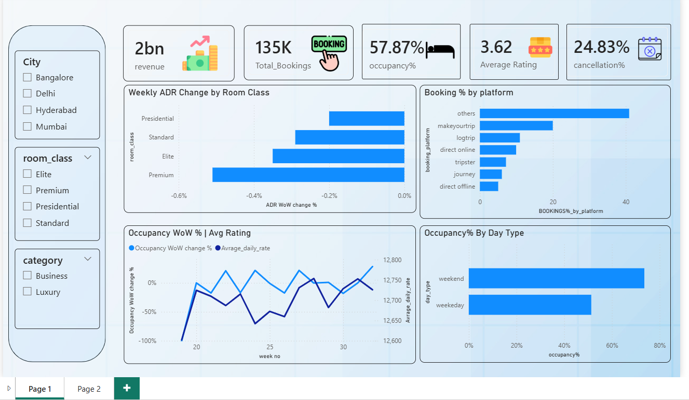

# 📊Insights-for-the-Hospitality-Revenue-Team!
  This​‍​‌‍​‍‌​‍​‌‍​‍‌ project uses an interactive Power BI dashboard to assess the revenue and occupancy performance of a hospitality business.

  ---
## 📌 Table of Contents
- <a href="#overview">Executive Summary</a>
- <a href="#business-problem">Business Problem</a>
- <a href="#dataset">Dataset</a>
- <a href="#Business-Objective ">Business Objective </a>
- <a href="#tools--technologies">Tools & Technologies</a>
- <a href="#KPIs-Covered">KPIs Covered</a>
- <a href="#Key-insights">Key-insights</a>
- <a href="#dashboard">Dashboard</a>
- <a href="#Final-Recommendations">Final-Recommendations</a>
- <a href="#author--contact">Author & Contact</a>

---

<h2>Executive Summary</h2>
This​‍​‌‍​‍‌​‍​‌‍​‍‌ project uses an interactive Power BI dashboard to assess the revenue and occupancy performance of a hospitality business. The study is mainly concentrated on business metrics such as revenue generated, revenue realized, occupancy rate, ADR, RevPAR, And Customer ratings.
The main goal of this project is to provide the revenue management teams with the right hand of the management in the form of the decision-making process.
Most of the findings show upward trends of occupancy, good pricing performance, and a significant contribution of premium room categories. Nevertheless, the dependency on OTA platforms and lower ratings in certain room classes may lead to the profitability of the business being risked.
The recommendations derived from the insights are pricing strategy optimization during high-demand periods, the focus on direct bookings and service quality improvement to increase customer satisfaction and revenue ‌ ​‍​‌‍​‍‌​‍​‌‍​‍‌sustainability.

---

<h2>Business Problem</h2>
AtliQ Grands, an established five-star hotel chain in India, is currently losing market share and revenue, particularly within the **Luxury/Business hotels category**. This decline is attributed to strategic moves by competitors and internal ineffective decision-making. To counter this, the managing director is initiating a strategic move to incorporate **Business and Data Intelligence** to regain market position. Since AtliQ Grands lacks an in-house data analytics team, they have hired a third-party service provider to provide data-driven insights. The core objective is to analyze historical data and create a dashboard and insights that specifically compare performance across the Luxury and Business segments to guide the revenue team's recovery strategy.

---

<h2>Dataset</h2>

[Click here to get dataset]() 

---

<h2>Business Objective </h2>
The objective of this analysis is to :
  
  - Track weekly performance trends

  - Identify revenue and occupancy drivers

  - Support pricing and distribution strategy decisions

  - Enable data-driven decision making for stakeholders

---

<h2>Tools & Technologies</h2>

- Python – Used for initial data cleaning and transformation of the raw dataset.
- SQL – Used to structure the data and run complex queries to uncover customer trends.
- Power BI – Used to design interactive dashboards that visualize key business metrics.
- DAX & Data Modeling – Used within Power BI to create custom calculations and logically connect different data tables. 

---

<h2> 📊KPIs Covered</h2>

* Total Revenue
* Total Bookings
* Occupancy Percentage
* Cancellation Percentage
* Average Customer Rating

---

<h2> Key-insights</h2>

* Overall occupancy across the period was 57.87%
* Out of 2.0 Bn in revenue generated, 1.7 Bn was realized, resulting in a realization rate of approximately 85%
* Premium room categories deliver higher ADR
* Occupancy levels are consistently higher during weekends, indicating stronger leisure-driven demand.
* The ‘Other’ booking channel contributes the highest share of bookings, exceeding MakeMyTrip, LogTrip, and Direct Online platforms.
* Mumbai leads in total revenue driven by the highest booking volume, while Delhi records the highest occupancy. Hyderabad shows balanced performance, whereas Bangalore underperforms on occupancy and customer ratings.

--- 

<h2>Dashboard</h2>

- Power BI Dashboard shows
  - Summary
  - Total Revenue  
  - Total Bookings 
  - Occupancy%
  - Avg Rating
  - Cancellation%   

---
<h2>Final Recommendations</h2>

- **Strengthen Revenue Conversion**  
  Reduce the gap between revenue generated and realized by closely monitoring cancellations and no-shows, especially in high-demand cities like Mumbai and Delhi.

- **City-Specific Demand Optimization**  
  Apply targeted pricing and promotional strategies based on city performance, leveraging high occupancy in Delhi and high booking volume in Mumbai to improve revenue quality.

- **Improve Customer Experience in Underperforming Cities**  
  Focus on service quality and guest experience improvements in Bangalore to address lower occupancy and customer ratings that may impact long-term demand.

- **Optimize Weekday Utilization**  
  Introduce weekday-focused offers and corporate partnerships to balance higher weekend occupancy and improve overall room utilization.

- **Channel Mix Optimization**  
  Analyze the ‘Other’ booking channel in detail and shift growth toward more controllable digital channels to reduce dependency and improve margin efficiency.

<h2>Author & Contact</h2>

---
**Omkar Kotkar**  
Data Analyst  
📧 Email: kotkaromkar988@gmail.com   
🔗 [LinkedIn](https://www.linkedin.com/in/omkar-kotkar/)  
